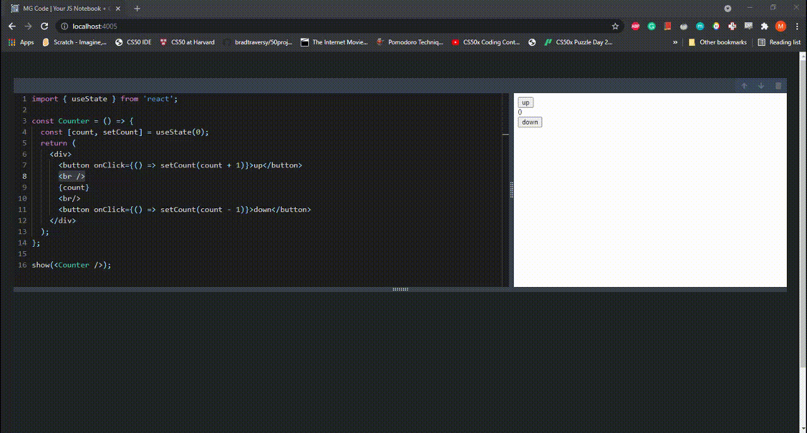

<h1 align="center">Welcome to MG Note (mgcode) 👋</h1>
<p>
  <a href="https://www.npmjs.com/package/mgnote" target="_blank">
    
  </a>
  <a href="https://twitter.com/mgrahimm" target="_blank">
    
  </a>
</p>

<p align='center'>Ever wonder how to code in <strong>JavaScript or React</strong><br> directly in the <strong>browser</strong> with <strong>VScode</strong> like editor,<br> <strong>Automatically run</strong> the code with a blink of your eye,<br> document with beautiful <strong>markdown text</strong>,<br> and finally, share the file with others to see!<br><br><em> Well, wait no more!</em></p>

<h2 align='center'>Introducing <strong>MG Note😍</strong></h2>
<p align='center'>Bundled with <a href="https://esbuild.github.io">ESbuild</a>, the fastest js bundler<br>
    <a href="https://melodyghost.github.io/mgcode-web/">View Demo</a>
    ·
    <a href="https://github.com/MelodyGhost/mgcode/issues">Report Bug</a>
    ·
    <a href="https://github.com/MelodyGhost/mgcode/issues">Request Feature</a>
</p>

<!-- TABLE OF CONTENTS -->
<details open="open">
  <summary>Table of Contents</summary>
  <ol>
    <li>
      <a href="#about-the-project">About The Project</a>
      <ul>
        <li><a href="#features">Features</a></li>
      </ul>
      <ul>
        <li><a href="#built-with">Built With</a></li>
      </ul>
    </li>
    <li>
      <a href="#getting-started">Getting Started</a>
      <ul>
        <li><a href="#prerequisites">Prerequisites</a></li>
        <li><a href="#installation">Installation</a></li>
      </ul>
    </li>
    <li><a href="#usage">Usage</a></li>
    <li><a href="#contributing">Contributing</a></li>
    <li><a href="#Author">Author</a></li>
    <li><a href="#show-your-support">The End</a></li>
  </ol>
</details>

<!-- ABOUT THE PROJECT -->

## About The Project



<a href='https://melodyghost.github.io/mgcode-web/'>
Check Out Live Demo (No Autosave)</a>

<br>

This is it, the project I always wanted to proudly present to the world. This took me more than 3 months of coding, searching, reading documentation, watching lots of tutorials. I wanted to build something unique. During the building proccess, I hit many roadblock, but every roadblock taught me something new.<br>
Below I listed some of the key features I think are great about this project.

### Feature:

- Run in command-line interface(CLI) and install it on your machine
- Friendly **VScode**-like editor with **auto Suggestion** and **syntax highlighting**. (fun fact: VScode and this editor uses the same library named Monaco)
- Document your code with a beautiful markdown editor
- **Autosave** to your hard drive
- Run the code automatically and preview the result
- You can open **multiple** code(+text) windows and they are **joined** with the previous code. Which means you can access a variable from the previous code window
- Import any **JS** (and **CS**) library directly. No installation is required!
- Built-in **Reactjs** support. No need to import 'react' and 'react-dom'
- Added a **show()** function, which can directly display jsx or, any js value.
- Rearrange the opened window with **'up'** and **'down'** arrow
- **Prettier** format button
- Auto generates a **.js** file on your hard drive. You can share it with anyone

I hope to add more features in the future. If you have any specific features in mind let me know. Or better yet you can add feature forking this project. To know how, see the **Contributing** sections.

### Built With

- [Reactjs](https://reactjs.org)
- [Typescript](https://typescriptlang.org)
- [React-Redux](https://react-redux.js.org) for state management
- [Expressjs](https://expressjs.com) for backend
- [Commander](https://npmjs.com/package/commander) for CLI
- [Monaco Library]()
- [Lerna]() for managing 3 different package

lots of other packages

<!-- GETTING STARTED -->

## Getting Started

This package is installable if you already installed nodejs on your system. Follow the instruction below to get started ⏬

### Prerequisites

> You have to have [nodejs](https://nodejs.org) installed on your machine
> <br>

### Installation

1. Go to your preferred directory ex: c://\<folder-name>/
2. Open Command Interface of your choice. **ex**: _cmd_, _powershell_, _git-cli_ etc...
3. Run the following command to install mgnote globally
   ```sh
   npm i -g mgnote
   ```
   Now you can run mgnote anywhere in your machine.

### Don't want to install anything?

Run this instead for a quick run

```sh
npx mgnote serve
```

## Usage

To start using the app, enter the following command

```sh
mgnote serve
```

**That's it!** You will see a local server link in your cli. Copy and paste the link to the browser. Finally hit enter. You will see a beautiful website appeared on your screen.
<br>

<em>By default a file, named **notebook.js** will get created for you</em>
<br>

**you can optionally specify a port number (if default port is not available) and book name**

```sh
mgnote serve [file-name.js] [-p ****]
```

**example:**

```sh
mgnote serve mybook.js -p 3030
```

If you are done editing, you can share the file (**notebook.js** or, **mgnote** whatever) created in your chosen directory with the world\*

<br>

_or maybe you want to save some **JS function** or **React component** and document how they work.<br> **MG Note** got you covered!_

<!-- CONTRIBUTING -->

## Contributing

Any contributions you make are **greatly appreciated**.

1. Fork the Project
2. Create your Feature Branch (`git checkout -b feature/AmazingFeature`)
3. Commit your changes (`git commit -m 'Add some AmazingFeature'`)
4. Push to the Branch (`git push origin feature/AmazingFeature`)
5. Open a Pull Request

## Author

👤 **MG Rahim**

- Twitter: [@mgrahimm](https://twitter.com/mgrahimm)
- Github: [@melodyghost](https://github.com/melodyghost)
- LinkedIn: [@mgrahim](https://linkedin.com/in/mgrahim)

## Show your support

Give a ⭐️ if you like this project!
